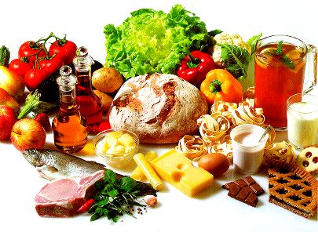
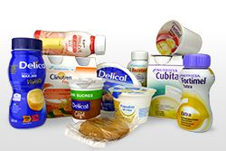
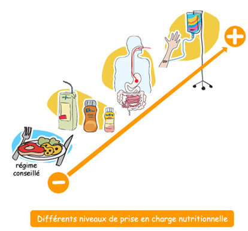

# Diététique et transplantation

## Avant la transplantation hépatique

L'alimentation est le mélange du plaisir et de la raison. Les aliments font partie de la vie et donnent du bonheur. Pendant la période d’attente de la  transplantation, il sera important de mieux connaitre les bonnes « fréquentations alimentaires ».

La maladie hépatique dont vous souffrez peut être responsable d'une perte d'appétit, d’un amaigrissement et d'une fonte musculaire. Parfois une ascite s’installe qui majore la dénutrition et dans 30% des cas, un diabète favorisé par la cirrhose peut apparaître.
La réponse médicale habituelle sur le plan diététique est l’instauration de régimes très restrictifs sans sel, sans sucre ou  pauvre en protéines. Dans d'autres cas, la prescription médicale sera orientée  sur la réduction de l'obésité et de la graisse hépatique …..&#x1F61E;&#x1F61E;
La plupart des patients relèvent la difficulté de manger, le problème de la satiété rapide, l'absence de plaisir alimentaire et la fatigue que représente l'acte de se nourrir.

> Pour vous aider un conseil diététique spécialisé et individualisé vous sera systématiquement proposé (Mme N Goncalves, tel : 01 49 81 49 28 ; email : [nathalie.goncalves@aphp.fr](mailto:nathalie.goncalves@aphp.fr))

Bien manger en attendant la greffe... pour améliorer son immunité aussi !

Pendant la période d'attente, il va falloir gérer certaines atteintes de la maladie du foie par exemple l'ascite (œdème abdominal),  et préparer le terrain immunitaire pour arriver le jour J avec des qualités nutritionnelles renforcées : l'immuno nutrition commence dans l'assiette !

Comment fait-on pour manger sans sel, sans sucre, sans graisse et sans alcool, bref que restera-t-il dans votre assiette lorsque viendra le moment de se mettre à table ?

Le moment de passer à table peut vite devenir un cauchemar ! Le bénéfice de bien se nourrir   pendant cette période est pourtant essentiel.
Pour vous aider, je vous propose des idées de menus [Tableau 1] à consulter immédiatement avant de la lire la suite,  qui vont vous aider à garder le plaisir de manger tout en respectant les contraintes diététiques médicales.
Il est possible que certaines personnes soient découragées si elles ne savent ou ne peuvent pas faire la cuisine ou les courses. Dans ce cas, il peut être utile d’avoir recours à la diététicienne pour adapter des repas et établir une liste de courses en fonction des moyens.

### L’alimentation peu salée pour les problèmes d'œdèmes ou ascite.
La consommation moyenne de sel en France est proche des 10 à 11 grammes par jour. La prescription médicale pour laquelle on constate un bénéfice sur la réduction de l'ascite est de 3grammes de sel par jour.
En France, nous avons une tradition  alimentaire d'aliments salés : le pain, le fromage, la charcuterie, les conserves, les plats préparés du commerce....

> Il va donc falloir  apprendre à choisir les aliments pauvres en sel et opter pour une cuisine maison ! [Tableau 2]

L’idéal est par exemple de préparer du potage maison, d’acheter ou fabriquer du pain sans sel, d’utiliser des herbes aromatiques et des épices, de l'huile d'olive, de remplacer la moutarde/les bouillons cubes par des produits sans sel équivalents... Penser à manger plus souvent des légumes, des fruits, des féculents, des légumineuses, de l'ail, de l'oignon, du poisson, des laitages....

La cuisine sans sel, oui mais sans goût, non !!Utilisez des épices ! [Tableau 3]

### Le problème du sucre et du diabète
Si vous avez déjà rencontré un diététicien dans votre existence, vous savez que le sucre doit être limité en cas de diabète **mais** qu'il faut conserver  la moitié de son alimentation en sucre lents (féculent, légumes secs, fruits, pain). Les fruits sont indispensables, 2 à 3 par jour [Tableau 4].

### L’assistance nutritionnelle : quand est-elle nécessaire ?
Lorsque l'alimentation seule ne suffit plus à apporter l’énergie, les vitamines et les minéraux indispensables, c'est à dire lorsque les apports nutritionnels ne couvrent pas 60 % des besoins, le risque de dénutrition doit être identifié. Il est alors recommandé  une assistance nutritionnelle. [Tableau 5 et 6]

La première étape consiste à donner des conseils diététiques individualisés d'enrichissement alimentairs et selon les besoins, à prescrire des compléments nutritionnels oraux (CNO). Il existe  une très large gamme de présentation et de goûts (jus de fruits, boisson lactée, crèmes, potage, gâteau....) pour majorer les apports nutritionnels.

Lorsque l'alimentation  est insuffisante ou impossible, l'alimentation artificielle va pouvoir prendre le relais. Le bénéfice de la nutrition artificielle par la voie digestive normale (nutrition entérale)  a montré sa supériorité depuis des dizaines d'années sur le plan de la réduction des infections et de la durée d’hospitalisation. La nutrition par voie veineuse peut aussi être associée ou prescrite en  exclusivité en cas de déficit nutritionnel.

