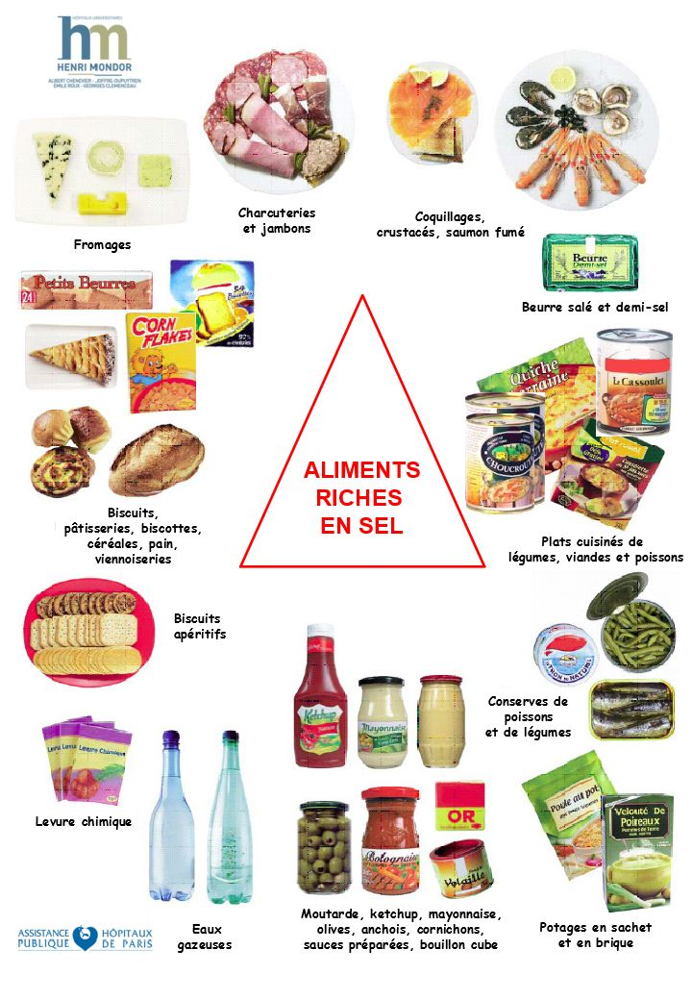
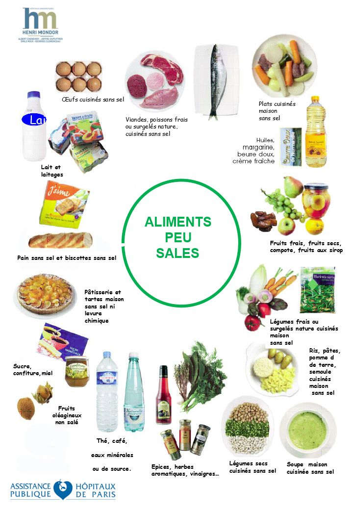
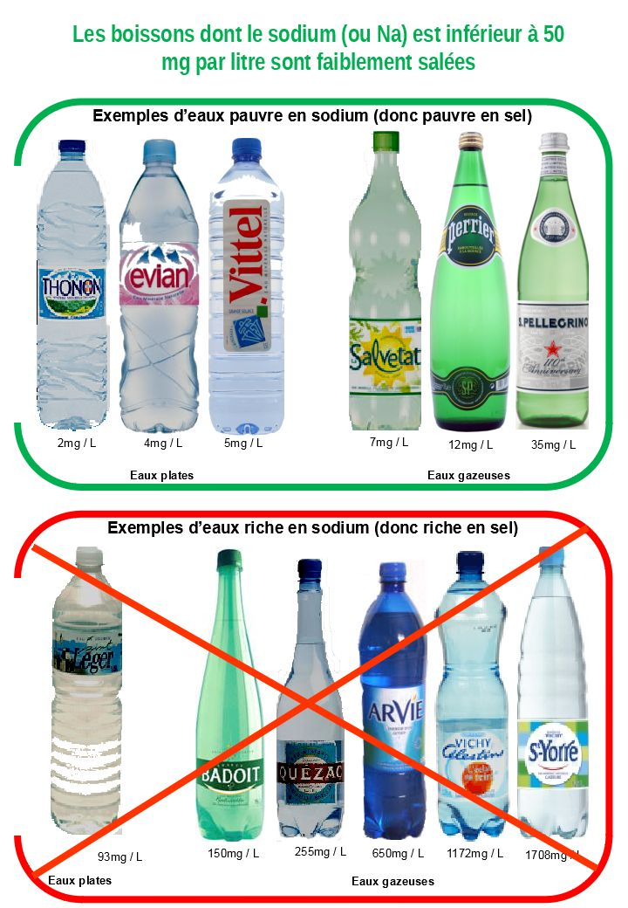
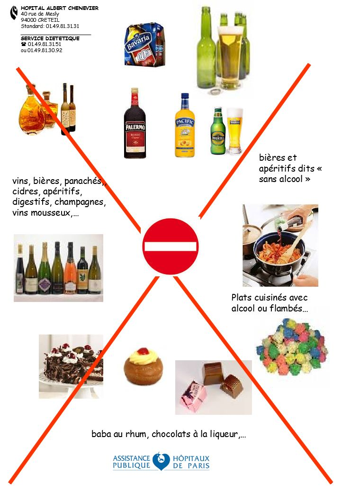
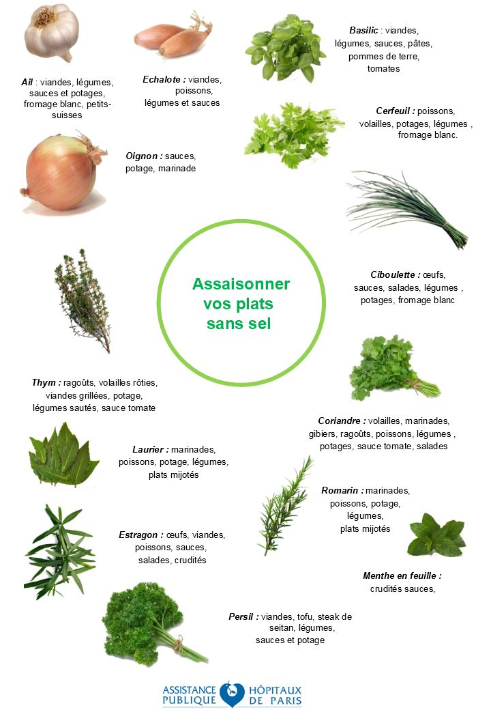
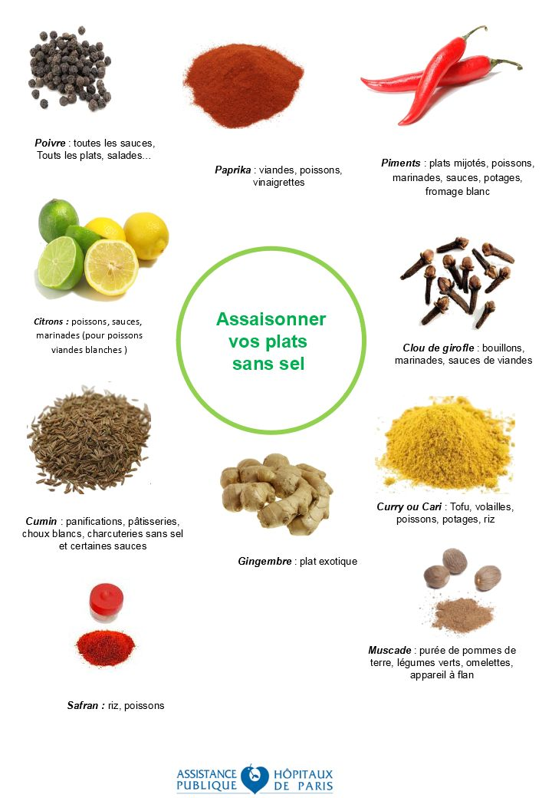
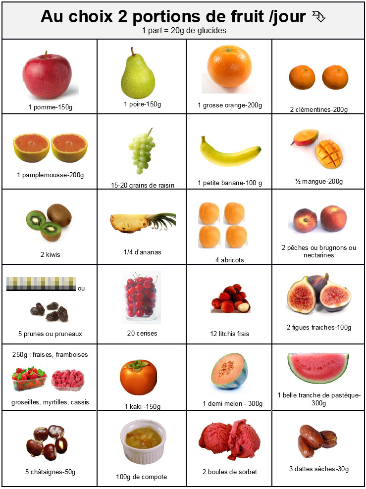
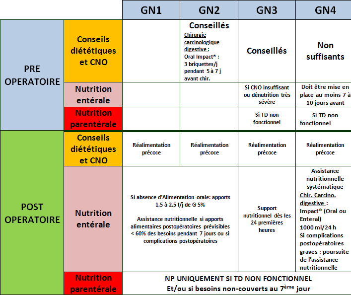

# Diététique et transplantation

## Avant la transplantation hépatique

L'alimentation est le mélange du plaisir et de la raison. Les aliments font partie de la vie et donnent du bonheur. Pendant la période d’attente de la  transplantation, il sera important de mieux connaitre les bonnes « fréquentations alimentaires ».

La maladie hépatique dont vous souffrez peut être responsable d'une perte d'appétit, d’un amaigrissement et d'une fonte musculaire. Parfois une ascite s’installe qui majore la dénutrition et dans 30% des cas, un diabète favorisé par la cirrhose peut apparaître.
La réponse médicale habituelle sur le plan diététique est l’instauration de régimes très restrictifs sans sel, sans sucre ou  pauvre en protéines. Dans d'autres cas, la prescription médicale sera orientée  sur la réduction de l'obésité et de la graisse hépatique …..&#x1F61E;&#x1F61E;
La plupart des patients relèvent la difficulté de manger, le problème de la satiété rapide, l'absence de plaisir alimentaire et la fatigue que représente l'acte de se nourrir.

> Pour vous aider un conseil diététique spécialisé et individualisé vous sera systématiquement proposé ([Contact](contact.html#diététicienne-mme-canonne))

Bien manger en attendant la greffe... pour améliorer son immunité aussi !

Pendant la période d'attente, il va falloir gérer certaines atteintes de la maladie du foie par exemple l'ascite (œdème abdominal),  et préparer le terrain immunitaire pour arriver le jour J avec des qualités nutritionnelles renforcées : l'immuno nutrition commence dans l'assiette !

Comment fait-on pour manger sans sel, sans sucre, sans graisse et sans alcool, bref que restera-t-il dans votre assiette lorsque viendra le moment de se mettre à table ?

Le moment de passer à table peut vite devenir un cauchemar ! Le bénéfice de bien se nourrir   pendant cette période est pourtant essentiel.
Pour vous aider, je vous propose des idées de menus à consulter immédiatement avant de la lire la suite,  qui vont vous aider à garder le plaisir de manger tout en respectant les contraintes diététiques médicales.

Déjeuner | Dîner
---------|---------
Carottes râpées aux raisins secs Poulet rôti au citron et à l’ail Haricots verts au curcuma et  huile d’olive Fromage blanc Pomme Pain [1] | Avocat huile d’olive et jus de citron Ratatouille (fraîche ou surgelée) + reste de poulet en lamelles Riz créole ou Pain [1] Fromage sans sel [2] Poire
Cresson, vinaigrette à l’huile de colza Emincée de canard au thym et au gingembre Pâtes à l’estragon yaourt Poire | Potage de légumes maison Salade de lentilles maison, oignons, persil, vinaigrette à l’huile de colza Petit Suisse Banane
Betteraves à l’ail, vinaigrette à l’huile de colza Pois chiche maison en curry avec  curcuma Petit suisse Pêche | Salade d’endives, pomme, noix, vinaigrette à l’huile de noix Saumon en papillote au curry et gingembre Poireaux au cumin Fromage blanc Kiwis Pain [1]
Champignons au citron et huile d’olive Tajine d’agneau aux fèves, à la coriandre et au miel Yaourt Ananas frais | Concombre au fromage blanc et à la  ciboulette Pot au feu de bœuf  dégraissé (poireau, bouquet garni, oignon, ail, os à moelle, carotte, céleri) Clémentines Pain [1] ou pomme de terre du pot au feu
Frisée aux pignons de pin et huile de colza Salade de pomme de terre à l’échalote et persil Dos de cabillaud en salade et jus de citron Suisse Sorbet au citron | Salade de pâtes, tomates séchées, basilic et huile d’olive Œuf dur sur lit d’épinards à la crème Fromage sans sel [2] Salade de fruit frais et noix Pain [1]
Betterave vinaigrette à l’huile de colza, ail et persil Filet de sardines en papillote Riz au curry Faisselle Coulis de fruits rouges |  Salade de choux rouge et blanc et huile de noix Boulettes de viande hachée à la tomate fraîche au basilic et muscade Semoule aux herbes yaourt Orange
Fenouil au jus de citron Filet mignon aux noisettes Ecrasée de pomme de terre à l’ail et huile d’olive Fromage blanc mangue | Artichaut vinaigrette à l’huile de colza Pizza maison (pâte à pain sans sel) avec tomate, oignons, brocolis, œufs, Fromage sans sel [2] Pèche

**[1] pain sans sel vendu en boulangerie sur commande ou grande surface au rayon boulangerie  
[2] fromage sans sel vendu à la coupe en grande surface ou en fromagerie(ne pas confondre avec fromage allégé en matières grasse qui est salé)**

> Site conseillé pour les recettes : [marmitton.com](marmiton.com), en excluant les ingrédients salés (sel, bouillon cube, moutarde) et l’alcool.

Il est possible que certaines personnes soient découragées si elles ne savent ou ne peuvent pas faire la cuisine ou les courses. Dans ce cas, il peut être utile d’avoir recours à la diététicienne pour adapter des repas et établir une liste de courses en fonction des moyens.

### L’alimentation peu salée pour les problèmes d'œdèmes ou ascite.
La consommation moyenne de sel en France est proche des 10 à 11 grammes par jour. La prescription médicale pour laquelle on constate un bénéfice sur la réduction de l'ascite est de 3grammes de sel par jour.
En France, nous avons une tradition  alimentaire d'aliments salés : le pain, le fromage, la charcuterie, les conserves, les plats préparés du commerce....

> Il va donc falloir  apprendre à choisir les aliments pauvres en sel et opter pour une cuisine maison !

****

L’idéal est par exemple de préparer du potage maison, d’acheter ou fabriquer du pain sans sel, d’utiliser des herbes aromatiques et des épices, de l'huile d'olive, de remplacer la moutarde/les bouillons cubes par des produits sans sel équivalents... Penser à manger plus souvent des légumes, des fruits, des féculents, des légumineuses, de l'ail, de l'oignon, du poisson, des laitages....

La cuisine sans sel, oui mais sans goût, non ! **Utilisez des épices** !

****

### Le problème du sucre et du diabète
Si vous avez déjà rencontré un diététicien dans votre existence, vous savez que le sucre doit être limité en cas de diabète **mais** qu'il faut conserver  la moitié de son alimentation en sucre lents (féculent, légumes secs, fruits, pain). Les fruits sont indispensables, 2 à 3 par jour.

### L’assistance nutritionnelle : quand est-elle nécessaire ?
Lorsque l'alimentation seule ne suffit plus à apporter l’énergie, les vitamines et les minéraux indispensables, c'est à dire lorsque les apports nutritionnels ne couvrent pas 60 % des besoins, le risque de dénutrition doit être identifié. Il est alors recommandé  une assistance nutritionnelle.

La première étape consiste à donner des conseils diététiques individualisés d'enrichissement alimentairs et selon les besoins, à prescrire des compléments nutritionnels oraux (CNO). Il existe  une très large gamme de présentation et de goûts (jus de fruits, boisson lactée, crèmes, potage, gâteau....) pour majorer les apports nutritionnels.

Lorsque l'alimentation  est insuffisante ou impossible, l'alimentation artificielle va pouvoir prendre le relais. Le bénéfice de la nutrition artificielle par la voie digestive normale (nutrition entérale)  a montré sa supériorité depuis des dizaines d'années sur le plan de la réduction des infections et de la durée d’hospitalisation. La nutrition par voie veineuse peut aussi être associée ou prescrite en  exclusivité en cas de déficit nutritionnel.

## Manger sans sel : oui mais comment ?

En France, nous avons une tradition alimentaire d'aliments salés : le pain, le fromage, la charcuterie, les conserves, les plats préparés du commerce, les fruits de mer...  
Il va donc falloir  apprendre à choisir les aliments pauvres en sel et opter pour une cuisine maison ! Pour cuisiner, utilisez des aliments frais ou surgelés au naturel (non cuisinés).
Certains aliments salés peuvent vous manquer ; voici donc quelques pistes pour trouver leur remplacement.

### Où trouver des produits sans sel ?

* Boulangerie : vous pouvez commander à votre boulanger du pain sans sel, que vous pouvez congeler (tranché pour un côté pratique) pour en avoir tous les jours.
* Magasins bio / diététiques : certains proposent des aliments s/sel dans leurs rayons (moutarde, ketchup…).
* Grandes surfaces : certains produits sans sel peuvent être proposés
  - au rayon diététique : selon les magasins, quelques produits sans sel sont disponibles.
  - au rayon conserves : certaines sont spécifiées sans sel (marque Connetable®). Attention : les produits dits « à teneur réduite en sel » ou « allégé en sel » ne sont pas sans sel.
  - aux surgelés : vous pouvez trouver des viandes / poissons / légumes au naturel donc sans sel.
  - à la coupe : des fromages sans sel.
* Picard® : vous trouverez du pain sans sel à faire cuire vous-même, des potages et bouillons de légumes sans sel. Plus de renseignements sur leur site internet : [picard.fr](http://www.picard.fr/article-23.html?fdid=santeNutrition#article-23).
* Internet : certains sites proposent des produits sans sel sur commande :
  - [dietissod.fr](www.dietissod.fr) : renseignements au 09.64.16.58.31. Produits Dr RITTER / PLENIDAY.
  - [00sel.com](www.00sel.com)
  - [agrodor.fr](www.agrodor.fr) : produits BORNIBUS diététique
  - [tousansel](www.tousansel.com) : on peut également acheter leurs produits dans l’épicerie « Tousansel », située au [57 Boulevard Batignolles, Paris 8e](https://www.openstreetmap.org/node/841786697#map=19/48.88142/2.31805).

Regardez les étiquettes ; méfiez-vous des aliments où la mention « sel » ou « sodium » apparaît.

> Rappel : 1g de sel = 0,4g de sodium ou 400mg de sodium.
