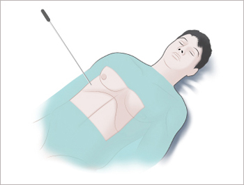
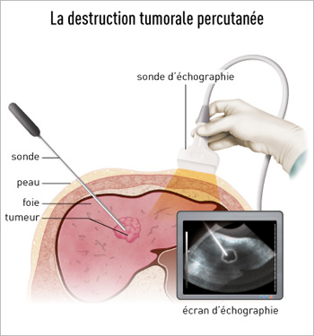
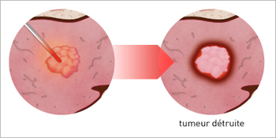
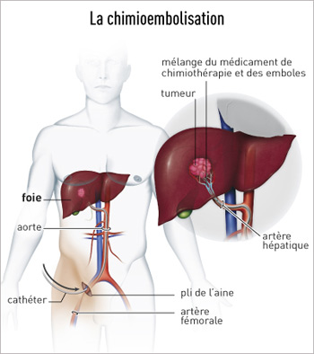
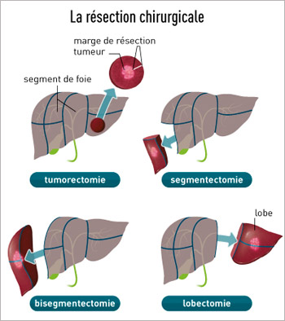

# Prise en charge de la maladie initiale pendant la phase d’attente

## Le carcinome hépato-cellulaire :
Une fois inscrit sur liste, le temps d’attente en vue de la greffe pour carcinome hépato-cellulaire est en général de 12 à 15 mois. Il est donc essentiel pendant cette période de pouvoir commencer à traiter votre tumeur pour l’empêcher de progresser au-delà d’un stade pour lequel la greffe deviendrait contre indiquée.

## Le choix du traitement d’attente

4 types de traitement peuvent vous être proposés pour cela. Le choix du traitement est effectué au cours  d’une réunion à laquelle participent votre médecin référent et les différents spécialistes impliqués dans la prise en charge de cette maladie.

### La radiofréquence (destruction per cutanée)

Cette technique, conduite sous anesthésie générale, consiste à détruire à l’aide d’une électrode chauffante votre tumeur hépatique, en passant à travers la peau. La procédure, très efficace,  nécessite environ 1 heure et  s’applique à des lésions (ou nodules) tumoraux de petite taille , inférieur à 3 cm de diamètre habituellement, et peu nombreux : 1 à 2 lésions. Si la fonction du foie est trop altérée, notamment en cas de trouble de la coagulation, de plaquettes trop basses ou d’ascite, cette technique ne peut pas s’appliquer.  Un mois après le traitement un scanner ou une IRM de contrôle sont effectués pour vérifier qu’il n’y a plus de tumeur active. Si du tissu tumoral actif persiste, une seconde séance peut être réalisée. Dans tous les cas la surveillance par un scanner tous les 3 mois doit être poursuivie jusqu’à la greffe.  La procédure nécessite 24h d’hospitalisation.

[Plus d'informations](http://www.e-cancer.fr/Patients-et-proches/Les-cancers/Cancer-du-foie/Radiofrequence)

### La chimioembolisation

Cette technique s’adresse à des lésions plus nombreuses ou plus volumineuses, lorsque la fonction de votre foie le permet. Elle consiste à faire monter, sous anesthésie locale, une petite sonde souple (un cathéter) au contact des vaisseaux qui irriguent votre ou vos tumeurs  et à injecter dans celles-ci de fines particules pour obstruer (emboliser) ces vaisseaux et provoquer la destruction de la lésion. Cette injection est couplée à l’injection locale d’une chimiothérapie. La chimiothérapie n’a pas d’effet secondaire mais l’embolisation peut générer des douleurs hépatiques et de la fièvre, qui traduisent en général une bonne réponse au traitement. Ici aussi, l’efficacité du traitement est contrôlée par un scanner un mois après la procédure puis tous les 3 mois. La procédure peut ainsi être renouvelée 2 à 3 fois  jusqu’à la greffe. Elle nécessite à chaque fois une hospitalisation de 48h.

[Plus d'informations](http://www.e-cancer.fr/Patients-et-proches/Les-cancers/Cancer-du-foie/Chimioembolisation)

### La radioembolisation

Le principe est voisin de celui de la chimioembolisation mais les particules injectées dans l’artère nourricière de votre tumeur sont ici des particules radioactives. La radio embolisation est précédée d’une première radiographie de vos artères abdominales pour s’assurer que la technique est faisable ; la surveillance trimestrielle de la tumeur doit aussi être effectuée ;

### La résection chirurgicale

Dans certains cas, assez rares, l’équipe médico-chirurgicale en charge de votre dossier peut considérer que l’ablation limitée de votre tumeur par chirurgie (on dit  résection  chirurgicale) peut être une solution pour attendre la greffe. Cette  technique n’est envisageable que lorsque la fonction de votre foie est excellente. L’indication de transplantation hépatique après cette 1ère opération doit être maintenue car le tissu hépatique laissé en place reste cirrhotique et expose à la survenue d’une 2nde tumeur. La transplantation est cependant différée jusqu’à la survenue d’une autre tumeur. Vous serez alors placé en contre indication temporaire sur la liste de greffe jusqu’à réapparition d’une 2nde lésion, ce qui survient en un délai très variables allant de quelques mois à plusieurs années. La surveillance tous les 3 mois par scanner de votre foie est indispensable pendant cette période.

[Plus d'informations](http://www.e-cancer.fr/Patients-et-proches/Les-cancers/Cancer-du-foie/L-ablation-partielle)

## Procédures d’accès facilité à la greffe

Le carcinome hépato cellulaire est actuellement la 1ère cause de transplantation en France et un grand nombre de patients sont donc inscrits sur liste d’attente pour cette maladie. Les règles de l’Agence de la Biomédecine ont donc pour objectif  de transplanter plus rapidement les patients qui ont besoin rapide de transplantation. Pour le carcinome hépato cellulaire, l’Agence permet un accès accéléré à la transplantation dans 2 situations :
* Les patients pour lesquels aucun traitement d’attente n’est réalisable,  pour des raisons anatomiques ou en cas de fonction hépatique altérée.  Un accès à la greffe en 6 mois est en général programmé.
* En cas de récidive après traitement d’une 1ère tumeur : ici aussi un accès à la greffe en 6 mois est planifié après la récidive.

## Cirrhoses virales et traitement antiviraux

### La cirrhose virale C

De nouveaux agents anti viraux C extrêmement efficaces et bien supportés, appelés agents anti viraux directs sont maintenant disponibles. Votre médecin hépatologue référent envisagera donc systématiquement avec vous la possibilité de traiter votre infection virale C pendant la phase d’attente de la transplantation.

L’intérêt est double :
1. Améliorer votre fonction hépatique pendant la phase d’attente :
    La guérison de l’infection virale C peut s’accompagner d’une amélioration de votre fonction hépatique reflétée par une amélioration de votre score MELD, avec disparition de l’ascite et de l’encéphalopathie. Cette amélioration peut survenir dans  près de 1 cas sur 5, surtout pour les patients avec un score MELD < 20 ; Elle peut conduire à une mise en contre-indication à la greffe pour amélioration voire à une sortie de liste pour amélioration. Dans cette dernière situation, vous continuerez à bénéficier d’un suivi très régulier pour vérifier que votre fonction hépatique se consolide sur le long terme.
2. Pévenir la récidive du VHC sur le nouveau foie :
    La guérison de l’hépatite C avant la greffe  permet d’éviter que le virus C ne réinfecte votre futur greffon et ne provoque de nouveaux dommages sur le foie greffé.

On considère actuellement que la balance entre les bénéfices et risques du traitement avant greffe est très favorable jusqu’à un score MELD de 20-21 ;

Le traitement consistera en  l’administration de 2 principes actifs par exemple Sofosbuvir et ledipasvir ou daclatasvir en combinaison avec de la ribavirine pendant une durée de 3 mois plus rarement 6 mois. Vous serez pendant le traitement pris en charge par votre hépatologue référent ainsi par l’infirmière référente Virus C, Mme Muriel François. Ceux-ci vérifieront la disparition définitive du virus C de votre sang, attendue dans plus de 90% des cas.

En cas d’inefficacité, un nouveau traitement anti viral C vous sera proposé après la transplantation

**Le carcinome hépato-cellulaire sur cirrhose virale C et utilisation des greffons VHC+**

Dans cette situation, les temps d’attente sont prolongés, supérieurs à 1 an. Dans certains cas, il pourra donc vous être proposé de pour pouvoir bénéficier d’un greffon ayant été en contact avec le virus C mais d’excellente qualité.  De nombreuses études ont déjà montré que l’utilisation de ce type de greffon permettait d’obtenir des résultats identiques à ceux des greffons VHC négatifs. L’utilisation de ce type de greffon, qui offre donc une chance supplémentaire d’accéder rapidement à la greffe, est complétement autorisée par l’Agence de la Biomédecine dans le cadre d’un protocole dit « dérogatoire » avec votre accord.  Il est important de savoir que dans 60% des cas, ces greffons ne comportent pas d’infection virale active (le virus a été éliminé) et il n’y aura donc pas de transmission du virus par le greffon. Dans 40% des cas le greffon est porteur du virus mais celui-ci sera traité très efficacement après la greffe par les nouveaux médicaments anti viraux avec une probabilité d’éradication du virus de plus de 90% si bien qu’ici aussi la possibilité d’être transplanté plus rapidement est avantage avec une balance entre bénéfices et risques très favorable.

Deux situations seront distinguées : si vous avez une multiplication virale C active avant la transplantation, vous pourrez bénéficier d’un greffon VHC + avec multiplication ou non.

Si vous n’avez pas de multiplication virale  active avant la greffe, vous pourrez bénéficier d’un greffon sans multiplication virale active.

### Cirrhose virale B

Depuis 10 ans maintenant il existe des médicaments antiviraux très efficaces (Baraclude® ou Viread®, 1 cp /j) qui permettent de bloquer la multiplication du virus de l’hépatite B (VHB).

Si le virus de l’hépatite B se multiplie encore dans votre foie (ADN du VHB positif),  il vous sera donc  proposer un traitement anti viral pendant la phase d’attente, à raison de 1 cp/ j jusqu’à la greffe à continuer après la greffe.

L’objectif de ce traitement  avant la transplantation est double :
1. Améliorer votre fonction hépatique : dans de nombreux cas notamment si la jaunisse associée à votre maladie hépatique est modérée et la charge virale B également faible ou modérée,  le traitement antiviral B peut permettre une amélioration significative de votre fonction hépatique et de votre score MELD. Cette amélioration peut conduire à une mise en contre-indication à la greffe pour amélioration voire à une sortie de liste pour amélioration. Dans cette dernière situation, vous continuerez à bénéficier d’un suivi très régulier pour vérifier que votre fonction hépatique se consolide sur le long terme.
2. Prévenir la récidive du VHB sur le nouveau foie :
    Avant l’apparition des nouveaux agents anti viraux B, la réinfection du greffon par le VHB était très fréquente et pouvait conduire à l’apparition d’une nouvelle cirrhose en moins de 3 ans. Les nouveaux médicaments anti viraux B en bloquant la multiplication du virus avant la greffe permettent de prévenir très efficacement la réinfection du greffon par le VHB et ses conséquences. Il faudra cependant poursuivre indéfiniment après la transplantation le traitement anti viral B (Baraclude® ou Viread ®) débuté avant la greffe pour éviter la contamination du nouveau foie en y associant des immunoglobulines anti virales B (IVBEX® ou Zutectra®).
    
### Utilisation des greffons anciennement en contact avec le VHB  (anti HBc +)

Dans certains cas, un greffon ayant été en contact avec le VHB et en ayant guéri sans séquelle (greffon anti HBc +/- anti HBs+) pourra vous être proposé car d’une part, vous disposerez d’un traitement anti viral B systématique après l’opération permettant de prévenir efficacement tout activation du virus après la greffe,  et d’autre part l’utilisation de ce type de greffon vous offre  la possibilité d’être transplanté plus rapidement tout en bénéficiant d’un greffon d’excellente qualité ; L’utilisation de ce type est autorisée par l’Agence de la Biomédecine dans le cadre d’un protocole dit « dérogatoire » avec votre accord
